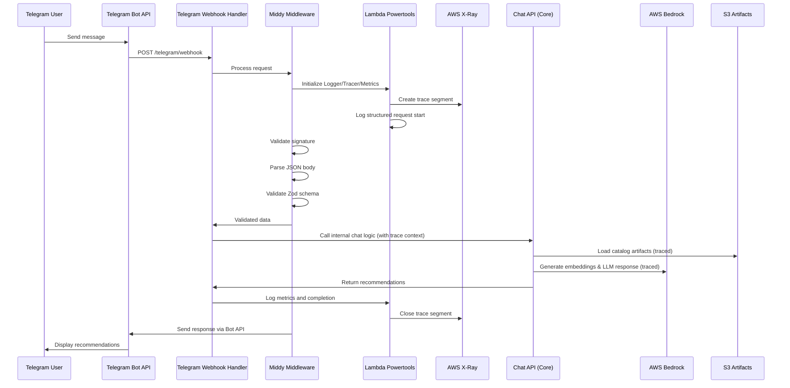

# Design Document: Telegram Chatbot Integration

## Overview

This design document outlines the implementation of a Telegram chatbot integration for the AI Commerce Recommender system. The chatbot will serve as a channel adapter that translates Telegram messages to and from the existing `/chat` API, enabling users to interact with the product recommendation system through Telegram.

The integration follows the established monorepo architecture principles, maintaining strict separation of concerns and keeping costs low through serverless implementation. All Lambda functions will use Middy middleware for validation and error handling, with AWS Lambda Powertools for comprehensive observability (logging, tracing, and metrics).

## Architecture

### High-Level Architecture

The Telegram integration consists of:

1. **Telegram Webhook Handler** (`packages/lambda/src/telegram-webhook.ts`)
   - Receives webhook events from Telegram Bot API
   - Uses Middy middleware for validation and error handling
   - Uses AWS Lambda Powertools for observability
   - Validates webhook signatures for security
   - Translates Telegram messages to internal chat format
   - Sends responses back to Telegram users

2. **Core Chat Integration** (existing `@ai-commerce/core`)
   - Reuses existing chat logic and recommendation engine
   - Enhanced with Powertools tracing context propagation
   - No modifications needed to core business logic
   - Maintains platform-neutral design

3. **Infrastructure Updates** (`packages/infra/src/stack.ts`)
   - New API Gateway endpoint for Telegram webhook
   - Lambda function deployment with X-Ray tracing enabled
   - Environment variables for Telegram Bot configuration
   - CloudWatch Logs configuration for structured logging

### Message Flow with AWS Lambda Powertools



## Components and Interfaces

### AWS Lambda Powertools Integration

**Powertools Configuration**:

```typescript
import { Logger } from "@aws-lambda-powertools/logger";
import { Tracer } from "@aws-lambda-powertools/tracer";
import { Metrics, MetricUnits } from "@aws-lambda-powertools/metrics";
import { captureLambdaHandler } from "@aws-lambda-powertools/tracer/middleware";
import { logMetrics } from "@aws-lambda-powertools/metrics/middleware";
import { injectLambdaContext } from "@aws-lambda-powertools/logger/middleware";

// Initialize Powertools
const logger = new Logger({
  serviceName: "telegram-chatbot",
  logLevel: process.env.LOG_LEVEL || "INFO",
  persistentLogAttributes: {
    version: process.env.SERVICE_VERSION || "1.0.0",
    environment: process.env.ENVIRONMENT || "dev",
  },
});

const tracer = new Tracer({
  serviceName: "telegram-chatbot",
  captureHTTPsRequests: true,
  captureResponse: true,
});

const metrics = new Metrics({
  namespace: "TelegramChatbot",
  serviceName: "telegram-chatbot",
  defaultDimensions: {
    environment: process.env.ENVIRONMENT || "dev",
    version: process.env.SERVICE_VERSION || "1.0.0",
  },
});
```

### Telegram Webhook Handler with Powertools and Middy

**Location**: `packages/lambda/src/telegram-webhook.ts`

**Complete Implementation with Powertools**:

```typescript
import middy from "@middy/core";
import jsonBodyParser from "@middy/http-json-body-parser";
import httpErrorHandler from "@middy/http-error-handler";
import validator from "@middy/validator";
import { transpileSchema } from "@middy/validator/transpile";
import { Logger } from "@aws-lambda-powertools/logger";
import { Tracer } from "@aws-lambda-powertools/tracer";
import { Metrics, MetricUnits } from "@aws-lambda-powertools/metrics";
import { captureLambdaHandler } from "@aws-lambda-powertools/tracer/middleware";
import { logMetrics } from "@aws-lambda-powertools/metrics/middleware";
import { injectLambdaContext } from "@aws-lambda-powertools/logger/middleware";

// Initialize Powertools
const logger = new Logger({
  serviceName: "telegram-chatbot",
  logLevel: process.env.LOG_LEVEL || "INFO",
});

const tracer = new Tracer({
  serviceName: "telegram-chatbot",
  captureHTTPsRequests: true,
});

const metrics = new Metrics({
  namespace: "TelegramChatbot",
  serviceName: "telegram-chatbot",
});

// Custom signature validation middleware with Powertools
const signatureValidator = (): middy.MiddlewareObj => ({
  before: async (request) => {
    const subsegment = tracer
      .getSegment()
      ?.addNewSubsegment("validate-signature");

    try {
      logger.debug("Validating Telegram signature", {
        operation: "validate-signature",
        hasSignature:
          !!request.event.headers["x-telegram-bot-api-secret-token"],
      });

      const signature =
        request.event.headers["x-telegram-bot-api-secret-token"];
      const body = request.event.body;

      if (!validateTelegramSignature(body, signature)) {
        metrics.addMetric("SignatureValidationFailed", MetricUnits.Count, 1);

        logger.warn("Invalid Telegram signature detected", {
          operation: "validate-signature",
          hasSignature: !!signature,
          bodyLength: body?.length,
        });

        throw new TelegramSignatureError("Invalid signature");
      }

      metrics.addMetric("SignatureValidationSuccess", MetricUnits.Count, 1);
      logger.debug("Signature validation successful");

      subsegment?.addAnnotation("signatureValid", true);
      subsegment?.close();
    } catch (error) {
      subsegment?.addAnnotation("signatureValid", false);
      subsegment?.addAnnotation("error", error.message);
      subsegment?.close(error);
      throw error;
    }
  },
});

// Enhanced rate limiting middleware with metrics
const rateLimiter = (): middy.MiddlewareObj => ({
  before: async (request) => {
    const subsegment = tracer
      .getSegment()
      ?.addNewSubsegment("rate-limit-check");

    try {
      const userId =
        request.event.body?.message?.from?.id ||
        request.event.body?.callback_query?.from?.id;

      if (userId) {
        logger.debug("Checking rate limit", {
          operation: "rate-limit-check",
          userId,
        });

        const isLimited = await checkRateLimit(userId);

        if (isLimited) {
          metrics.addMetric("RateLimitExceeded", MetricUnits.Count, 1);
          metrics.addMetadata("userId", userId);

          logger.warn("Rate limit exceeded", {
            operation: "rate-limit-check",
            userId,
          });

          subsegment?.addAnnotation("rateLimited", true);
          subsegment?.addAnnotation("userId", userId);
          subsegment?.close();

          throw new Error("Rate limit exceeded");
        }

        subsegment?.addAnnotation("rateLimited", false);
        subsegment?.addAnnotation("userId", userId);
      }

      subsegment?.close();
    } catch (error) {
      subsegment?.close(error);
      throw error;
    }
  },
});

// Core handler function with Powertools
const telegramWebhookHandler = async (
  event: APIGatewayProxyEvent
): Promise<APIGatewayProxyResult> => {
  const subsegment = tracer
    .getSegment()
    ?.addNewSubsegment("process-telegram-update");

  try {
    logger.info("Processing Telegram update", {
      operation: "process-update",
      updateId: event.body?.update_id,
    });

    // Handler logic here - data is already validated by Middy
    const telegramUpdate = event.body as TelegramUpdate;

    // Extract user and chat info for enhanced logging and metrics
    const userId =
      telegramUpdate.message?.from?.id ||
      telegramUpdate.callback_query?.from?.id;
    const chatId =
      telegramUpdate.message?.chat?.id ||
      telegramUpdate.callback_query?.message?.chat?.id;
    const messageType = telegramUpdate.message ? "message" : "callback_query";

    // Add context to logger and tracer
    logger.appendKeys({
      userId,
      chatId,
      messageType,
      updateId: telegramUpdate.update_id,
    });

    subsegment?.addAnnotation("userId", userId);
    subsegment?.addAnnotation("chatId", chatId);
    subsegment?.addAnnotation("messageType", messageType);
    subsegment?.addAnnotation("updateId", telegramUpdate.update_id);

    // Record metrics
    metrics.addMetric("TelegramUpdateReceived", MetricUnits.Count, 1);
    metrics.addMetric(`UpdateType_${messageType}`, MetricUnits.Count, 1);
    metrics.addMetadata("userId", userId);
    metrics.addMetadata("chatId", chatId);

    logger.debug("Extracted message details", {
      operation: "extract-message",
      messageType,
      userId,
      chatId,
    });

    // Process the validated update
    const chatMessage = extractMessage(telegramUpdate);
    const chatResponse = await processChatMessage(chatMessage, tracer, logger);
    const telegramResponse = formatResponse(chatResponse);

    // Record success metrics
    metrics.addMetric("MessageProcessedSuccessfully", MetricUnits.Count, 1);
    metrics.addMetric(
      "RecommendationsGenerated",
      MetricUnits.Count,
      chatResponse.recommendations?.length || 0
    );

    logger.info("Update processed successfully", {
      operation: "process-update",
      recommendationCount: chatResponse.recommendations?.length || 0,
      responseLength: telegramResponse.text?.length || 0,
    });

    subsegment?.addAnnotation("success", true);
    subsegment?.addAnnotation(
      "recommendationCount",
      chatResponse.recommendations?.length || 0
    );
    subsegment?.close();

    return {
      statusCode: 200,
      body: JSON.stringify({ ok: true }),
      headers: {
        "X-Trace-Id": tracer.getRootXrayTraceId() || "unknown",
      },
    };
  } catch (error) {
    metrics.addMetric("MessageProcessingFailed", MetricUnits.Count, 1);

    logger.error("Failed to process update", {
      operation: "process-update",
      error: error.message,
      stack: error.stack,
    });

    subsegment?.addAnnotation("success", false);
    subsegment?.addAnnotation("error", error.message);
    subsegment?.close(error);

    throw error;
  }
};

// Middy wrapper with complete middleware stack including Powertools
export const handler = middy(telegramWebhookHandler)
  .use(injectLambdaContext(logger, { logEvent: true })) // Powertools logger context
  .use(captureLambdaHandler(tracer)) // Powertools X-Ray tracing
  .use(logMetrics(metrics, { captureColdStartMetric: true })) // Powertools metrics
  .use(jsonBodyParser()) // Parse JSON body
  .use(
    validator({
      eventSchema: transpileSchema(TelegramUpdateSchema), // Zod schema validation
    })
  )
  .use(signatureValidator()) // Custom signature validation with tracing
  .use(rateLimiter()) // Custom rate limiting with metrics
  .use(httpErrorHandler()); // Handle errors gracefully
```

### Core Chat Integration with Powertools

```typescript
// Enhanced chat handler with Powertools integration
import { chatHandler } from "@ai-commerce/core";
import { Tracer } from "@aws-lambda-powertools/tracer";
import { Logger } from "@aws-lambda-powertools/logger";

const processChatMessage = async (
  chatMessage: ChatMessage,
  tracer: Tracer,
  logger: Logger
) => {
  const subsegment = tracer
    .getSegment()
    ?.addNewSubsegment("process-chat-message");

  try {
    logger.info("Processing chat message", {
      operation: "process-message",
      messageLength: chatMessage.userMessage?.length || 0,
      hasFilters: !!chatMessage.conversationState?.filters,
    });

    subsegment?.addAnnotation(
      "messageLength",
      chatMessage.userMessage?.length || 0
    );
    subsegment?.addAnnotation(
      "hasFilters",
      !!chatMessage.conversationState?.filters
    );

    // Transform Telegram message to internal format
    const chatRequest = {
      userMessage: chatMessage.userMessage,
      conversationState: {
        filters: chatMessage.conversationState?.filters || {},
        prefs: chatMessage.conversationState?.prefs || {},
      },
    };

    // Call existing chat logic - Powertools will automatically trace HTTP calls
    const chatResponse = await chatHandler(chatRequest);

    logger.info("Chat message processed successfully", {
      operation: "process-message",
      recommendationCount: chatResponse.recommendations?.length || 0,
      hasDebugInfo: !!chatResponse.debug,
    });

    subsegment?.addAnnotation("success", true);
    subsegment?.addAnnotation(
      "recommendationCount",
      chatResponse.recommendations?.length || 0
    );
    subsegment?.close();

    return chatResponse;
  } catch (error) {
    logger.error("Failed to process chat message", {
      operation: "process-message",
      error: error.message,
      stack: error.stack,
    });

    subsegment?.addAnnotation("success", false);
    subsegment?.addAnnotation("error", error.message);
    subsegment?.close(error);

    throw error;
  }
};
```

## Data Models

### Zod Schema Validation (unchanged)

All data models will use Zod for runtime validation and type safety, integrated with Middy:

```typescript
import { z } from "zod";

// Telegram-specific schemas
const TelegramUserSchema = z.object({
  id: z.number(),
  is_bot: z.boolean(),
  first_name: z.string(),
  last_name: z.string().optional(),
  username: z.string().optional(),
});

const TelegramChatSchema = z.object({
  id: z.number(),
  type: z.enum(["private", "group", "supergroup", "channel"]),
  title: z.string().optional(),
  username: z.string().optional(),
});

const TelegramMessageSchema = z.object({
  message_id: z.number(),
  from: TelegramUserSchema,
  chat: TelegramChatSchema,
  date: z.number(),
  text: z.string().optional(),
});

const TelegramUpdateSchema = z.object({
  update_id: z.number(),
  message: TelegramMessageSchema.optional(),
  callback_query: z
    .object({
      id: z.string(),
      from: TelegramUserSchema,
      message: TelegramMessageSchema.optional(),
      data: z.string().optional(),
    })
    .optional(),
});
```

### TypeScript Types from Zod Schemas

```typescript
type TelegramUser = z.infer<typeof TelegramUserSchema>;
type TelegramChat = z.infer<typeof TelegramChatSchema>;
type TelegramMessage = z.infer<typeof TelegramMessageSchema>;
type TelegramUpdate = z.infer<typeof TelegramUpdateSchema>;
```

## Correctness Properties

The system will be validated through comprehensive unit testing that covers:

### Core Functionality Validation

- Message translation between Telegram and internal formats
- Webhook signature validation with known test vectors
- Response formatting for different message types
- Error handling for various failure scenarios

### AWS Lambda Powertools Integration

- Proper X-Ray trace generation and propagation
- Structured logging with correlation IDs
- Metrics collection and custom dimensions
- Cold start metrics and performance tracking

### Middy Middleware Validation

- Proper request/response processing through middleware stack
- Schema validation integration with Zod
- Error handling middleware behavior with Powertools
- Custom middleware functionality (signature validation, rate limiting)

### Data Validation

- All incoming Telegram webhooks validated against Zod schemas
- Proper error responses for malformed data with trace context
- Type safety throughout the message processing pipeline

## Error Handling

### Enhanced Error Handling with Powertools

```typescript
// Custom error types with Powertools integration
class TelegramValidationError extends Error {
  constructor(
    message: string,
    public statusCode: number = 400
  ) {
    super(message);
    this.name = "TelegramValidationError";
  }
}

class TelegramSignatureError extends Error {
  constructor(message: string = "Invalid signature") {
    super(message);
    this.name = "TelegramSignatureError";
    this.statusCode = 401;
  }
}

// Enhanced error handling middleware with Powertools
const powertoolsErrorHandler = (): middy.MiddlewareObj => ({
  onError: async (request) => {
    const { error } = request;

    // Powertools logger and tracer are automatically available
    if (error instanceof TelegramSignatureError) {
      logger.error("Signature validation failed", {
        operation: "validate-signature",
        error: error.message,
      });

      metrics.addMetric("SignatureValidationError", MetricUnits.Count, 1);

      request.response = {
        statusCode: 401,
        body: JSON.stringify({ error: "Unauthorized" }),
        headers: {
          "X-Trace-Id": tracer.getRootXrayTraceId() || "unknown",
        },
      };
      return;
    }

    if (error instanceof TelegramValidationError) {
      logger.error("Request validation failed", {
        operation: "validate-request",
        error: error.message,
      });

      metrics.addMetric("RequestValidationError", MetricUnits.Count, 1);

      request.response = {
        statusCode: 400,
        body: JSON.stringify({
          error: "Validation failed",
          details: error.message,
        }),
        headers: {
          "X-Trace-Id": tracer.getRootXrayTraceId() || "unknown",
        },
      };
      return;
    }

    // Log unexpected errors with Powertools
    logger.error("Unexpected error occurred", {
      operation: "handle-error",
      error: error?.message || "Unknown error",
      stack: error?.stack,
    });

    metrics.addMetric("UnexpectedError", MetricUnits.Count, 1);

    // Let default error handler manage other errors
  },
});
```

## Testing Strategy

### Unit Tests with Powertools Integration

```typescript
import { handler } from "../telegram-webhook";

// Mock Powertools for testing
jest.mock("@aws-lambda-powertools/logger");
jest.mock("@aws-lambda-powertools/tracer");
jest.mock("@aws-lambda-powertools/metrics");

describe("Telegram Webhook Handler with Powertools", () => {
  test("processes valid Telegram update with tracing", async () => {
    const validEvent = {
      body: JSON.stringify({
        update_id: 123,
        message: {
          message_id: 456,
          from: { id: 789, is_bot: false, first_name: "John" },
          chat: { id: 789, type: "private" },
          date: 1640995200,
          text: "Hello bot",
        },
      }),
      headers: {
        "x-telegram-bot-api-secret-token": "valid-signature",
      },
    };

    const result = await handler(validEvent, {} as any);

    expect(result.statusCode).toBe(200);
    expect(result.headers["X-Trace-Id"]).toBeDefined();
  });

  test("records metrics for successful processing", async () => {
    const mockMetrics = require("@aws-lambda-powertools/metrics");

    const validEvent = {
      body: JSON.stringify({ update_id: 123 }),
      headers: { "x-telegram-bot-api-secret-token": "valid-signature" },
    };

    await handler(validEvent, {} as any);

    expect(mockMetrics.addMetric).toHaveBeenCalledWith(
      "TelegramUpdateReceived",
      expect.any(String),
      1
    );
  });

  test("logs structured entries with Powertools", async () => {
    const mockLogger = require("@aws-lambda-powertools/logger");

    const validEvent = {
      body: JSON.stringify({ update_id: 123 }),
      headers: { "x-telegram-bot-api-secret-token": "valid-signature" },
    };

    await handler(validEvent, {} as any);

    expect(mockLogger.info).toHaveBeenCalledWith(
      "Processing Telegram update",
      expect.objectContaining({
        operation: "process-update",
      })
    );
  });
});
```

## Implementation Notes

### Dependencies

```json
{
  "dependencies": {
    "zod": "^3.22.0",
    "@types/aws-lambda": "^8.10.0",
    "@middy/core": "^5.0.0",
    "@middy/http-json-body-parser": "^5.0.0",
    "@middy/http-error-handler": "^5.0.0",
    "@middy/validator": "^5.0.0",
    "@aws-lambda-powertools/logger": "^2.0.0",
    "@aws-lambda-powertools/tracer": "^2.0.0",
    "@aws-lambda-powertools/metrics": "^2.0.0",
    "@aws-lambda-powertools/commons": "^2.0.0",
    "crypto": "built-in"
  }
}
```

### Environment Variables with Powertools Configuration

```typescript
const EnvSchema = z.object({
  // Telegram configuration
  TELEGRAM_BOT_TOKEN: z.string().min(1),
  TELEGRAM_WEBHOOK_SECRET: z.string().min(1),
  TELEGRAM_API_URL: z.string().url().default("https://api.telegram.org"),

  // Core system configuration
  CATALOG_BUCKET: z.string().min(1),
  CATALOG_PREFIX: z.string().min(1),
  TITAN_EMBED_MODEL_ID: z.string().min(1),
  CLAUDE_MODEL_ID: z.string().min(1),
  AWS_REGION: z.string().min(1),

  // Powertools configuration
  LOG_LEVEL: z.enum(["DEBUG", "INFO", "WARN", "ERROR"]).default("INFO"),
  POWERTOOLS_SERVICE_NAME: z.string().default("telegram-chatbot"),
  POWERTOOLS_METRICS_NAMESPACE: z.string().default("TelegramChatbot"),
  POWERTOOLS_LOGGER_LOG_EVENT: z.string().default("false"),
  POWERTOOLS_LOGGER_SAMPLE_RATE: z.string().default("0.1"),
  POWERTOOLS_TRACE_DISABLED: z.string().default("false"),
  POWERTOOLS_TRACER_CAPTURE_RESPONSE: z.string().default("true"),
  POWERTOOLS_TRACER_CAPTURE_ERROR: z.string().default("true"),
  POWERTOOLS_METRICS_CAPTURE_COLD_START_METRIC: z.string().default("true"),
});
```

### Infrastructure Configuration for Powertools

```typescript
// CDK configuration for Lambda with Powertools
const telegramWebhookFunction = new Function(this, "TelegramWebhookFunction", {
  runtime: Runtime.NODEJS_18_X,
  handler: "telegram-webhook.handler",
  code: Code.fromAsset("dist"),
  environment: {
    // Powertools environment variables
    POWERTOOLS_SERVICE_NAME: "telegram-chatbot",
    POWERTOOLS_METRICS_NAMESPACE: "TelegramChatbot",
    POWERTOOLS_LOGGER_LOG_EVENT: "false",
    POWERTOOLS_LOGGER_SAMPLE_RATE: "0.1",
    POWERTOOLS_TRACE_DISABLED: "false",
    POWERTOOLS_TRACER_CAPTURE_RESPONSE: "true",
    POWERTOOLS_TRACER_CAPTURE_ERROR: "true",
    POWERTOOLS_METRICS_CAPTURE_COLD_START_METRIC: "true",

    // Application environment variables
    LOG_LEVEL: "INFO",
    TELEGRAM_BOT_TOKEN: telegramBotToken.valueAsString,
    TELEGRAM_WEBHOOK_SECRET: telegramWebhookSecret.valueAsString,
    // ... other environment variables
  },
  tracing: Tracing.ACTIVE, // Enable X-Ray tracing
  timeout: Duration.seconds(30),
  memorySize: 512,
});

// Grant necessary permissions for Powertools
telegramWebhookFunction.addToRolePolicy(
  new PolicyStatement({
    effect: Effect.ALLOW,
    actions: [
      "xray:PutTraceSegments",
      "xray:PutTelemetryRecords",
      "logs:CreateLogGroup",
      "logs:CreateLogStream",
      "logs:PutLogEvents",
    ],
    resources: ["*"],
  })
);
```

### Observability Benefits with Powertools

**Structured Logging**:

- Automatic correlation IDs and request context
- JSON formatted logs for easy parsing
- Configurable log levels and sampling
- Automatic cold start detection

**Distributed Tracing**:

- Automatic X-Ray integration
- HTTP request/response capture
- Custom subsegments for business logic
- Trace correlation across services

**Custom Metrics**:

- Business metrics (messages processed, errors, etc.)
- Performance metrics (duration, cold starts)
- Custom dimensions for filtering
- Automatic CloudWatch integration

**Performance Monitoring**:

- Cold start metrics
- Function duration tracking
- Memory usage monitoring
- Error rate tracking

This design leverages AWS Lambda Powertools to provide enterprise-grade observability while maintaining the existing architecture principles and performance requirements. Powertools handles the complexity of structured logging, distributed tracing, and metrics collection, allowing the business logic to focus on the core functionality.
